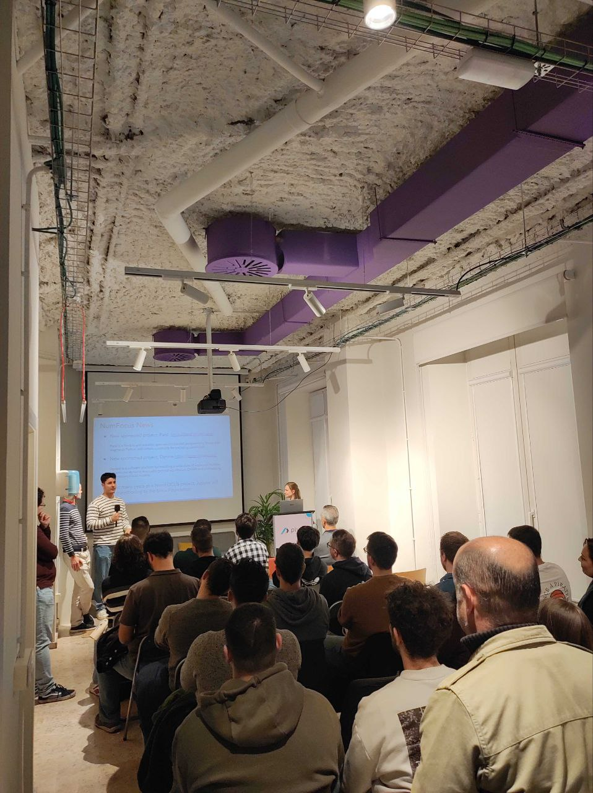
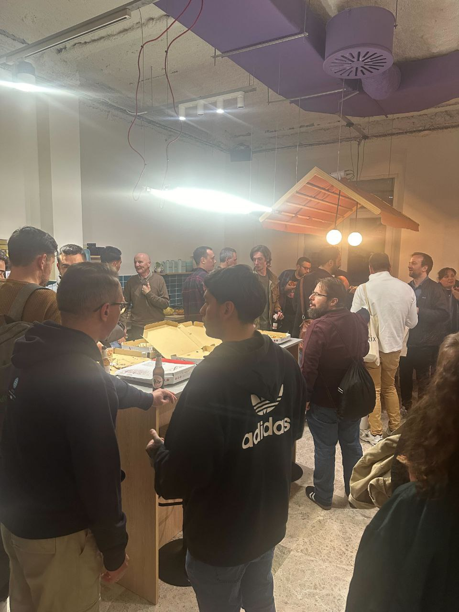

.. toctree::
   :glob:
   :hidden:

   *

.. _intro:

###########
Micropython
###########

.. revealjs-section::
    :data-background-color: #36760d
    :data-transition-speed: slow
    :data-transition: fade

**Programación fácil y para todos de microcontroladores**

.. revealjs-notes::

  Hola a todos, muchas gracias por venir.

Sobre mí **Nekmo**
==================

.. revealjs-section::
    :data-background-color: #090a0f
    :data-transition-speed: slow
    :data-transition: fade

+------------------------------------+
|                                    |
| .. image:: images/cara.svg         |
|   :width: 200px                    |
|                                    |
| *Programador Python*               |
|                                    |
+------------------------------------+

.. revealjs-notes::

   Soy Juan José, aunque muchos me conocen en redes como Nekmo, y puede que me conozcáis por charlas anteriores para Python Málaga

Otras charlas...
================

----------

.. image:: images/python-malaga-logo-white.png
   :width: 10%
   :align: center

.. image:: images/plytix-logo-white.svg
   :width: 35%
   :align: center

.. revealjs-section::
    :data-background-color: #090a0f

.. revealjs-notes::

   Como la última que tuvimos en Plytix, la empresa para la que trabajo, y que podéis encontrar disponible online.
   Pero en esta ocasión, tendremos una charla un tanto diferente, aquí en OpenSouthCode...

Micropython
===========

.. image:: images/micropython-logo.svg
   :width: 35%
   :align: center

.. revealjs-section::
    :data-background-color: #090a0f

.. revealjs-notes::

   Vamos a hablar de microcontroladores y Micropython, un ámbito seguramente diferente para muchos. Por ello, me
   gustaría saber cuántos conocéis ya sobre este mundillo.

Microcontroladores
==================

.. revealjs-section::
    :data-background-color: #000000
    :data-background-image: _static/microcontrollers_background.png

.. revealjs-notes::

   No os preocupéis por los que no conozcáis sobre este el tema, ya que iremos desde el principio.

¿Qué son?
---------

.. revealjs-section::
    :data-background-color: #090a0f

.. revealjs-fragments::

    * **Ventajas**

      * 🤏 Pequeños
      * 🤑 Económicos
      * 🪫 Bajo consumo

    * **Desventajas**

      * 🐢 Poco potentes
      * 😓 Programación más compleja

.. revealjs-notes::

   Como os podréis imaginar por el nombre, los microcontroladores son pequeños ordenadores, como puede ser una Raspberry
   Pi, pero mucho más pequeños y con menos recursos. Entre sus ventajas tenemos [...] y entre sus desventajas [...].

Algunos **usos**
----------------

.. revealjs-section::
    :data-background-color: #090a0f

.. revealjs-fragments::

    * ☁️ Domótica
    * 🤖 Robótica
    * 🔌 Electrónica
    * 🚧 Prototipos
    * ...

.. revealjs-notes::

   Se utilizan en muchos ámbitos, como la domótica, robótica, electrónica, prototipos y muchos más.

GIF robot
---------

.. revealjs-section::
    :data-background-color: #333333
    :data-background-video: _static/robot_fall.mp4
    :data-background-video-loop: true
    :data-background-size: cover

.. revealjs-notes::

   Gracias a ellos, podréis competir contra Boston Dynamics en robótica, y conseguir imágenes graciosas como esta.

Micropython
===========

.. image:: images/micropython-logo.svg
   :width: 35%
   :align: center

.. revealjs-section::
    :data-background-color: #090a0f

.. revealjs-notes::

   Si recordáis, hemos dicho como uno de sus puntos débiles que son difíciles de programar. Y hasta hace no mucho era
   así. Pero desde hace unos años, tenemos algunas soluciones como Micropython que nos permiten programar estos
   microcontroladores de una forma más sencilla. Micropython es una variante de Python 3 reducida y adaptada para
   algunos de estos microcontroladores.

Variantes
---------

.. revealjs-section::
    :data-background-color: #090a0f

.. revealjs-fragments::

    * **ESP8266/ESP32**

      * 🤑 Muy **económico**
      * 😄 Múltiples **variantes**
      * 👥 Gran **comunidad**

    * **Raspberry Pi Pico**

      * 💸 **Económico**
      * 🔨 Gran **soporte**
      * 📚 Bien **documentado**

.. revealjs-notes::

   Entre los microcontroladores que soportan Micropython podemos destacar los ESP8266 y ESP32 [...] o la Raspberry Pi Pico [...], u otros más caros como la PyBoard, la oficial de Miccropython.

ESP32
=====

.. revealjs-section::
    :data-background-color: #000000
    :data-background-image: _static/esp32_background.jpg

.. revealjs-notes::

   Pero en esta presentación vamos a utilizar un ESP32, porque sencillamente...

Dinero
------

.. revealjs-section::
    :data-background-color: #333333
    :data-background-video: _static/empty_wallet.mkv
    :data-background-video-loop: true
    :data-background-size: cover

.. revealjs-notes::

   ... la pela es la pela. Y es que son los más económicos.

Características
---------------

.. revealjs-section::
    :data-background-color: #090a0f

.. revealjs-fragments::

    * 💪 **Doble** núcleo
    * 🛜 Conectividad **WiFi**
    * 📡 Conectividad **Bluetooth**
    * 🔌 Múltiples pines **GPIO**
    * 📟 **ADC** / **DAC**

.. revealjs-notes::

   Pero no sólo es barato. También tiene un montón de características interesantes como [...]. Y todo ello partiendo
   desde 3-4€.

**Primeros** pasos
------------------

.. revealjs-section::
    :data-background-color: #090a0f

.. revealjs-fragments::

    * ⚡ **Flashear** siguiendo la web de `Micropython <https://micropython.org/>`_
    * 📝 **IDE web** *(ViperIDE)* o local *(Thonny)*

.. revealjs-notes::

   Y empezar con Micropython es muy sencillo. Sólo tenéis que descargar el binario del sitio web oficial, y flashearlo
   mediante la herramienta indicado. Tras ello, podéis usar un IDE web como Viper IDE, o un IDE local como Thonny.

Demos
=====

.. revealjs-section::
    :data-background-color: #333333
    :data-background-video: _static/resistor_fire.mp4
    :data-background-video-loop: true
    :data-background-size: cover

.. revealjs-notes::

   Y ya me voy callando, que seguro que lo que queréis ver son cosas en acción, y demos que luego no funcionarán.

Encender un **led**
===================

.. revealjs-section::
    :data-background-color: #333333
    :data-background-video: _static/leds.mp4
    :data-background-video-loop: true
    :data-background-size: cover

.. revealjs-notes::

   Vamos a empezar por lo más sencillo de todo. Encender un led. El ejemplo más típico de todos.

Identificar **los pines**
-------------------------

.. revealjs-section::
   :data-background-color: #DDDDDD

.. image:: images/datasheet.png
   :width: 60%

.. revealjs-notes::

   Aunque antes de empezar cualquier circuito, es imprescindible identificar los pines de nuestro controlador. Buscad
   vuestro modelo y encontraréis un datasheet como este. Los pines GPIO, que suelen empezar por G o algo similar, son
   los que nos interesan.

**Conectar** el led
-------------------

.. revealjs-section::
   :data-background-color: #DDDDDD

.. video:: _static/sheet1.mkv
   :autoplay:
   :loop:
   :muted:

.. revealjs-notes::

   Empezar con un led es tan sencillo como conectarlo en su polo positivo a un pin GPIO y el negativo a tierra.
   Opcionalmente podemos añadir una resistencia para proteger el led, aunque no es imprescindible.

Código **led**
--------------

.. revealjs-section::
    :data-background-color: #090a0f

.. micropython-demo::
   :video: _static/demo1.mp4

   from machine import Pin
   from time import sleep

   led = Pin(1, Pin.OUT)

   while True:
       led.on()
       sleep(0.5)
       led.off()
       sleep(0.5)

.. revealjs-notes::

   El código fuente es tal que así. En este ejemplo, haremos encender y apagarse el led en tiempos de medio segundo.
   Como podéis observar, el código es muy similar al Python de siempre, donde utilizamos la librería de GPIO para
   definir qué pin, en este caso el GPIO 1, es el que queremos utilizar. Luego, lo inicializamos como salida. Tendremos
   así una salida digital, es decir, binaria, que puede ser 0 o 1.

Led **analógico**
-----------------

.. revealjs-section::
    :data-background-color: #090a0f

.. micropython-demo::
   :video: _static/demo2.mp4

   from machine import Pin, PWM
   from time import sleep

   led = PWM(Pin(1), freq=1000)

   while True:
       for i in range(0, 1024, 10):
           led.duty(i)
           sleep(0.01)
       for i in range(1023, -1, -10):
           led.duty(i)
           sleep(0.01)

.. revealjs-notes::

   El ejemplo anterior funcionaba de forma digital. Es decir, que el led sólo podía encenderse y apagarse. Pero si
   utilizamos una salida analógica, indicada como PWM, podemos entregar más valores, entre 0 y 1024, para así variar
   la intensidad del led.

GIF luces LED
-------------

.. revealjs-section::
    :data-background-color: #333333
    :data-background-video: _static/house_leds.mp4
    :data-background-video-loop: true
    :data-background-size: cover

.. revealjs-notes::

   Y ahora, ya sabéis cómo llenar vuestra casa de lucecitas LED.

Conectar **un botón**
=====================

.. revealjs-section::
   :data-background-color: #DDDDDD

.. video:: _static/sheet3.mkv
   :autoplay:
   :loop:
   :muted:

.. revealjs-notes::

   No sólo podemos entregar valores de salida. También podemos leer valores de entrada, como es el caso de un botón.
   La conexión es igualmente sencilla, pero no utilizaremos una resistencia, ya que el propio microcontrolador tiene una
   resistencia pull-up interna. Si queréis más detalles al respecto, me podéis preguntar al finalizar la charla. Y así
   ya os dejo una pregunta para el final.

**Código** botón
----------------

.. revealjs-section::
    :data-background-color: #090a0f

.. micropython-demo::
   :video: _static/demo3.mp4

   from machine import Pin
   from time import sleep

   button = Pin(1, Pin.IN, Pin.PULL_UP)

   while True:
       state = not button.value()
       print(int(state))
       sleep(0.1)

.. revealjs-notes::

   Tenemos algo muy similar al led, pero en este caso el pin como entrada, y hemos configurado el pull-up interno.
   Gracias al pull-up, protegeremos el pin de cortocircuitos, pero debemos tener en cuenta que por ello tendremos valor
   1 cuando el botón no esté presionado, y valor 0 cuando sí lo esté.

GIF recreativa
--------------

.. revealjs-section::
    :data-background-color: #333333
    :data-background-video: _static/arcades.mp4
    :data-background-video-loop: true
    :data-background-size: cover

.. revealjs-notes::

   Con esto, ya estáis capacitados para crear vuestra propia recreativa con todos los botones que queráis.

Conectar un **LED RGB**
=======================

.. revealjs-section::
   :data-background-color: #DDDDDD

.. video:: _static/sheet4.mkv
   :autoplay:
   :loop:
   :muted:

.. revealjs-notes::

   Y para vuestra recreativa, no pueden faltar LEDs RGB a todo color. Como muchos sabréis, las siglas de RGB proceden de
   Red, Green y Blue, que son los colores primarios de la luz. Cada uno de estos colores corresponderá a un pin GPIO,
   por lo que necesitaremos tres pines, y un cuarto pin para tierra.

**Código** LED RGB
------------------

.. revealjs-section::
    :data-background-color: #090a0f

.. micropython-demo::
   :video: _static/demo4.mp4

   from machine import Pin, PWM
   from time import sleep
   import urandom

   r = PWM(Pin(1), freq=1000)
   g = PWM(Pin(2), freq=1000)
   b = PWM(Pin(3), freq=1000)

   def set_color(red, green, blue):
       r.duty(red)
       g.duty(green)
       b.duty(blue)

   while True:
       red = urandom.getrandbits(10)
       green = urandom.getrandbits(10)
       blue = urandom.getrandbits(10)
       set_color(red, green, blue)
       sleep(1)

.. revealjs-notes::

   El código es muy similar al que utilizamos antes con un led normal en modo analógico, pero en este caso tenemos 3
   pines, como si tuviésemos 3 leds diferentes, aunque en realidad están encapsulados en uno solo. Este código genera
   colores aleatorios, con valores 0 y 1024 para cada uno.

GIF cientos de cables
---------------------

.. revealjs-section::
    :data-background-color: #333333
    :data-background-video: _static/cables.mp4
    :data-background-video-loop: true
    :data-background-size: cover

.. revealjs-notes::

   Pero claro, si quisiésemos tener varios leds RGB, cada uno con su color, necesitaríamos un montón de cables y ocupar
   todos los pines GPIO de nuestra placa, los cuales son muy valiosos. Para ello disponemos de protocolos de
   comunicación, que nos permiten comunicarnos con varios dispositivos a la vez.

**Protocolos** de comunicación
==============================

.. revealjs-section::
    :data-background-color: #090a0f

.. revealjs-fragments::

    * 1️⃣ **OneWire** (1 pin)
    * 2️⃣ **I2C** (2 pines)
    * 3️⃣ **SPI** (3/4+ pines)
    * 📟 **UART** (2+ pines)

.. revealjs-notes::

   Disponemos de diferentes protocolos de comunicación, que suelen variar en el número de pines, en su velocidad,
   su uso, etc. Por ejemplo, oneWire sólo llega a necesitar un pin, pero es muy lento. I2C sólo necesita 2 pines, siendo
   muy popular. SPI parte de 3 a 4 pines, pudiendo requerir más si tenemos varios dispositivos. UART, que algunos
   recordaréis de los serial bus, parte de 2 pines... y así podríamos continuar. También tenemos protocolos específicos
   y diseñados para casos concretos, como el que veremos ahora. Recordad que con cada protocolo, necesitaremos utilizar
   adicionalmente una tierra, que no se cuenta como pin de comunicación.

Conectar un **led WS2812**
==========================

.. revealjs-section::
   :data-background-color: #DDDDDD

.. video:: _static/sheet5.mkv
   :autoplay:
   :loop:
   :muted:

.. revealjs-notes::

   Vamos a empezar con el protocolo WS2812, que es el que utilizan los LEDs RGB de tipo NeoPixel. Este protocolo
   unidireccional sólo necesita un pin de datos, pudiendo conectar varios LEDs a la vez, cada uno con su color. Tenemos
   como cables adicionales el de tierra y el de alimentación, que en este caso es de 5V.

**Código** LED WS2812
---------------------

.. revealjs-section::
    :data-background-color: #090a0f

.. micropython-demo::
   :video: _static/demo5.mp4

   import apa106
   from machine import Pin
   from time import sleep

   NUM_LEDS = 3
   PIN_NUM = 1

   leds = apa106.APA106(Pin(PIN_NUM), NUM_LEDS)
   colors = [(255, 0, 0), (0, 255, 0), (0, 0, 255)]
   positions = list(range(NUM_LEDS))

   while True:
       for i in range(NUM_LEDS):
           leds[i] = colors[positions[i]]
       leds.write()
       positions = [(pos + 1) % NUM_LEDS for pos in positions]
       sleep(0.5)

.. revealjs-notes::

   En este código utilizaremos el módulo apa106, incluido de serie en Micropython. Este módulo incluye ya el protocolo
   de comunicación WS2812, por lo que lo único que tendremos que hacer es definir el número de LEDs y el pin de datos.
   Rotaremos los colores RGB de cada entre cada uno de los LEDs.

**I2C**
=======

.. revealjs-section::
    :data-background-image: _static/i2c_background.png
    :data-background-size: cover

.. revealjs-notes::

   Aunque el protocolo WS2812 nos permite controlar múltiples LEDs individualmente con un solo cable, es un protocolo
   unidireccional diseñado en exclusiva para LEDs. En cambio, tenemos otros protocolos como I2C, que nos permiten
   comunicarnos con otros dispositivos, como pantallas, sensores, etc. Es un protocolo bidireccional que como dijimos
   antes, sólo necesita 2 pines.

Conectar **sensor** y **pantalla I2C**
======================================

.. revealjs-section::
   :data-background-color: #DDDDDD

.. video:: _static/sheet6.mkv
   :autoplay:
   :loop:
   :muted:

.. revealjs-notes::

   Vamos a conectar tanto la pantalla como un sensor de temperatura a un mismo I2C, el cual utiliza 2 pines, SDA y SCL.
   Necesitaremos además una tierra y una alimentación. Cada dispositivo I2C tiene una dirección única, la cual debemos
   conocer para comunicarnos con él. No obstante, podemos utilizar el escáner I2C para conocer la dirección de nuestros
   dispositivos. En este caso, la pantalla es una OLED de 128x64 píxeles, y el sensor un SHT41 para medir la temperatura
   y humedad.

**Código** sensor y pantalla I2C
--------------------------------

.. revealjs-section::
    :data-background-color: #090a0f

.. micropython-demo::
   :video: _static/demo6.mp4

   from machine import Pin, I2C
   from time import sleep
   import ssd1306
   import sht4x

   i2c = I2C(0, scl=Pin(1), sda=Pin(2))
   print(i2c.scan())
   oled = ssd1306.SSD1306_I2C(128, 64, i2c, 0x3C)
   sensor = sht4x.SHT4X(i2c, 0x44)

   while True:
       temperature, humidity = sensor.measurements
       oled.fill(0)
       oled.text("Temp: {:.1f} C".format(temperature), 0, 0)
       oled.text("Hum:  {:.1f} %".format(humidity), 0, 20)
       oled.show()
       sleep(2)

.. revealjs-notes::

   Para este código, hemos tenido que instalar 2 módulos adicionales, para lo cual podéis usar upip, el gestor de
   paquetes de Micropython. Hemos instalado el módulo ssd1306 para la pantalla, y el módulo sht4x para el sensor.
   Tenemos como direcciones para los dispositivos la 0x3C para la pantalla y la 0x44 para el sensor.

**WiFi** y **bluetooth**
========================

.. revealjs-section::
    :data-background-image: _static/wireless_background.png
    :data-background-size: cover

.. revealjs-notes::

   Pero no sólo disponemos de protocolos de comunicación alámbrica. En controladores como el ESP32 disponemos de Wifi,
   Bluetooth, y algunos modelos Zigbee.

**Código** coche
----------------

.. revealjs-section::
    :data-background-color: #090a0f

.. revealjs-section::
    :data-background-color: #000303

.. micropython-demo::
    :video: _static/demo7.mp4

    import json
    import time
    from math import sqrt
    import network
    import ubinascii
    import uhashlib
    import ustruct
    import web
    from hardware import I2C
    from hardware import Pin
    from web import WebSocket
    import uasyncio as asyncio

    i2c0 = I2C(0, scl=Pin(26), sda=Pin(0), freq=400000)
    i2c0.writeto_mem(0x38, 0x00, bytearray([0, 0, 0, 0]))

    ap = network.WLAN(network.AP_IF)
    ap.active(True)
    ap.config(essid='roverc.pro', password='roverc.pro', authmode=network.AUTH_WPA_WPA2_PSK)

    while not ap.active():
        time.sleep(1)

    ip = ap.ifconfig()[0]
    print('IP:', ip)

    app = web.App(host='0.0.0.0', port=80)

    def normalize_value(value: int | float) -> bytes:
        value = int(value)
        if value >= 128:
            value = 127  # The maximum value in positive is 127
        if value < 0:
            value = (256 + value)
        return value.to_bytes(1, "big")

    def coords_to_mecano_wheels(x: int, y: int, maximum: int = 127):
        r1 = x + y
        r2 = -x + y
        r3 = -x + y
        r4 = x + y
        # r3 = x + y
        # r4 = -x + y
        values = [r1, r2, r3, r4]
        max_val = max(abs(v) for v in values)
        if max_val > maximum:
            factor = maximum / max_val
            values = [v * factor for v in values]
        return [normalize_value(v) for v in values]

    async def serve_static(w, filename, mimetype):
        # write http headers
        w.write('HTTP/1.0 200 OK\r\n')
        w.write(f'Content-Type: {mimetype}; charset=utf-8\r\n')
        w.write('\r\n')
        # write page body
        with open(filename, 'r') as f:
            w.write(f.read())
        # drain stream buffer
        await w.drain()

    # root route handler
    @app.route('/')
    async def handler(r, w):
        return await serve_static(w, "index.html", "text/html")

    # root route handler
    @app.route('/joy.min.js')
    async def serve_script(r, w):
        return await serve_static(w, "joy.min.js", "application/javascript")

    # /ws WebSocket route handler
    @app.route('/ws')
    async def ws_handler(r, w):
        # upgrade connection to WebSocket
        ws = await WebSocket.upgrade(r, w)
        latest = None
        while True:
            evt = await ws.recv()
            if evt is None or evt['type'] == 'close':
                # handle closed stream/close event
                break
            elif evt['type'] == 'text':
                # print received messages and echo them
                print('Received:', evt['data'])
                data = json.loads(evt['data'])
                if "x" in data and "y" in data:
                    x, y = data['x'], data['y']
                    if (x, y) == latest:
                        continue
                    try:
                        wheel1, wheel2, wheel3, wheel4 = coords_to_mecano_wheels(x, y)
                    except OverflowError:
                        continue
                    print("Wheels:", *(w[0] for w in (wheel1, wheel2, wheel3, wheel4)))
                    i2c0.writeto_mem(0x38, 0x00, b"".join([wheel1, wheel2, wheel3, wheel4]))
                    latest = x, y
                elif "claw" in data:
                    value = 8 if data["claw"] else 87
                    i2c0.writeto_mem(0x38, 0x10, value.to_bytes(1, 'big'))

    # Start event loop and create server task
    loop = asyncio.get_event_loop()
    loop.create_task(app.serve())
    loop.run_forever()

.. revealjs-notes::

   En este último ejemplo no me voy a extender mucho. Inicializamos un access point, y un servidor web con soporte para
   websockets, el cual permite conectarnos al coche y controlarlo desde el navegador.

Demo **coche**
--------------

.. revealjs-section::
   :data-background-color: #DDDDDD

.. raw:: html

    <iframe src="http://192.168.4.1/" height="600px" width="100%" style="border: 0;"></iframe>

.. revealjs-notes::

   ¡Ahora, vamos a ver el coche en acción!

¡Pruébalo tú mismo!
-------------------

.. revealjs-section::
   :data-background-color: #DDDDDD

* **SSID:** roverc.pro
* **Password:** roverc.pro
* **Url:** http://192.168.4.1

.. revealjs-notes::

   Y por si os sabe a poco, ¡os invito a probarlo vosotros mismos! Conectad vuestro móvil al wifi del coche, y acceded a
   la dirección indicada.

¡Muchas gracias a todos!
========================

.. revealjs-section::
    :data-background-gradient: linear-gradient(-45deg, #ee7752, #e73c7e, #23a6d5, #23d5ab);

.. revealjs-notes::

    Y mientras os dejo jugando con el coche... ¡Hasta aquí la presentación! Espero que hayáis disfrutado y aprendido
    algo nuevo. Sé que he ido muy rápido, pero si tenéis dudas, estoy disponible para resolverlas.

Recursos
========

.. revealjs-section::
    :data-background-color: #333333
    :data-transition-speed: default
    :data-transition: fade

.. revealjs-fragments::

    * 🌐 **Web oficial**: https://micropython.org
    * 📝 **Editor online**: https://viper-ide.org
    * 🥽 **Simulador online**: https://wokwi.com

.. revealjs-notes::

   Os dejo aquí disponibles estos recursos, para empezar a trabajar con Micropython.

QR
==

.. revealjs-section::
    :data-background-color: #4973ff
    :data-transition-speed: slow
    :data-transition: fade

.. image:: images/qr.svg
    :width: 60%

.. revealjs-notes::

   Y por supuesto, también tenéis esta misma presentación, con los ejemplos de código y los diagramas.

Python **Málaga**
=================

.. revealjs-section::
    :data-background-color: #4973ff
    :data-transition-speed: slow
    :data-transition: fade

* 🌐 **Sitio web:** `python-malaga.es <https://www.python-malaga.es/>`_.
* 🤝 **Meetup:** `meetup.com/Python-Malaga <https://www.meetup.com/Python-Malaga/>`_.
* 🐦 **Twitter:** `@python_malaga <https://twitter.com/python_malaga>`_.
* ‍💼 **LinkedIn:** `linkedin.com/groups/13110576 <https://www.linkedin.com/groups/13110576/>`_.
* 📱 **Telegram:** `python_malaga <https://t.me/python_malaga>`_.

.. revealjs-notes::

   Y para más presentaciones, apuntaros a la comunidad de Python Málaga, donde hacemos más charlas como esta. No
   olvidéis seguirnos en nuestras redes sociales, y en nuestro grupo de Telegram.

**Contactar**
-------------

.. revealjs-section::
    :data-background-color: #333333
    :data-transition-speed: default
    :data-transition: fade

* 🌐 **Sitio web:** `nekmo.com <https://nekmo.com>`_
* 📫 **Email:** `contacto@nekmo.com <mailto:contacto@nekmo.com>`_
* 🐦 **Twitter:** `@nekmocom <https://twitter.com/nekmocom>`_
* 📱 **Telegram:** `@nekmo <https://t.me/nekmo>`_
* 💡 **Jabber:** `nekmo@nekmo.org <xmpp://nekmo@nekmo.org>`_

.. revealjs-notes::

   A cualquier cosa, tenéis mi contacto disponible.
